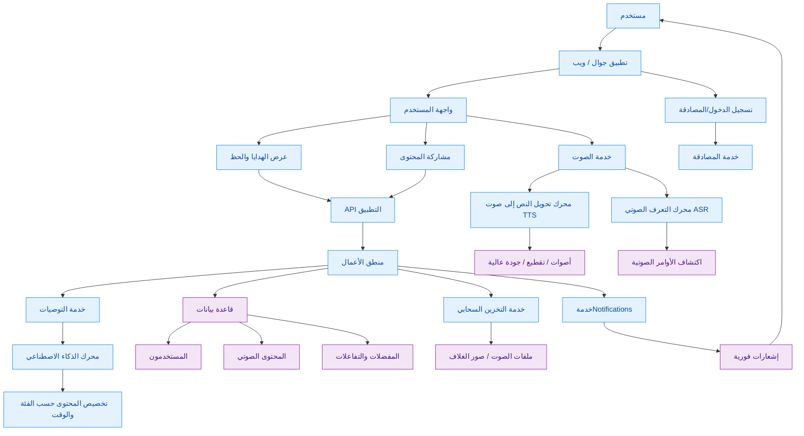

# هدايا الحظ - نظرة عامة على البنية

يوضح هذا المخطط العمارة المقترحة لتطبيق صوتي/محتوى "هدايا الحظ"، حيث يمكن للمستخدم الاستماع إلى رسائل أو اقتباسات أو أفكار إلهامية ومشاركتها في صورة صوتية أو نصية.

## مكونات النظام

- تطبيق جوال/ويب: واجهة المستخدم الأساسية لاستعراض هدايا الحظ والاستماع إلى المحتوى.
- خدمة المصادقة: إدارة تسجيل الدخول، المستخدمين، والحماية.
- خدمة الصوت: إنشاء ملفات صوتية، تحويل النص إلى كلام، وقراءة الأوامر الصوتية.
- API التطبيق: نقطة التواصل بين الواجهة ومنطق الأعمال.
- قاعدة البيانات: تخزين الحسابات، المحتوى، المفضلات، والإحصاءات.
- خدمة التخزين السحابي: حفظ التسجيلات الصوتية والصور والملفات المرفقة.
- خدمة الإشعارات: إرسال تنبيهات، تذكيرات، ومحتوى جديد.
- محرك التوصيات/الذكاء الاصطناعي: تخصيص الرسائل وفق الوقت، الاهتمامات، وسلوك المستخدم.

## سير العمل المقترح

1. يفتح المستخدم التطبيق.
2. يتم تسجيل الدخول أو إنشاء الحساب.
3. يتم عرض قائمة هدايا الحظ أو المحتوى الصوتي.
4. يطلب المستخدم تشغيل رسالة أو قراءة صوتية.
5. يتم تحويل النص إلى صوت أو تشغيل ملف صوتي مخزن.
6. يمكن للمستخدم مشاركة المحتوى أو حفظه أو التفاعل معه.
7. تُخزن البيانات في قاعدة البيانات ويتم إرسال الإشعارات عند الحاجة.

## فكرة التطبيق

هذا المخطط مناسب لتطبيق مثل:
- هدايا الحظ اليومية
- اقتباسات ملهمة
- رسائل نجاح وتحفيز
- تطبيقات صوتية للترانيم أو الكلمات الإيجابية

إذا رغبت، أستطيع في الخطوة التالية أن أجهز لك:
- نسخة أكثر احترافية من المخطط
- ملف README كامل باللغة العربية
- نسخة خاصة بتطبيقات الموبايل فقط
- نسخة خاصة بـ "موقع + API + قاعدة بيانات" بشكل كامل
