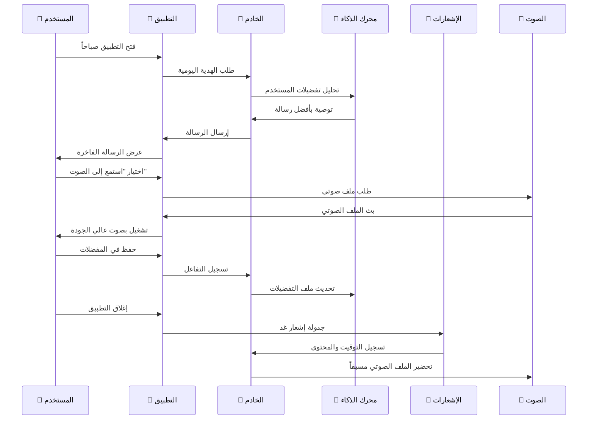

# 🎁 تطبيق هدايا الحظ اليومية - البنية المعمارية الفاخرة

> تطبيق متطور لتقديم هدايا الحظ والرسائل الملهمة يومياً مع إشعارات ذكية وتجربة صوتية راقية

---

## 📊 مخطط البنية المعمارية الشاملة

```mermaid
graph TB
    subgraph Client["🎨 طبقة العميل - Client Layer"]
        A["📱 تطبيق الموبايل<br/>iOS & Android<br/>Flutter/React Native"]
        B["🌐 تطبيق الويب<br/>React/Vue<br/>PWA"]
        C["⌨️ واجهة المستخدم<br/>تصميم فاخر وحديث<br/>Dark/Light Theme"]
    end

    subgraph Auth["🔐 طبقة المصادقة والأمان"]
        D["🔑 خدمة المصادقة<br/>OAuth 2.0<br/>Firebase Auth"]
        E["👤 إدارة الملفات الشخصية<br/>التفضيلات<br/>الإعدادات"]
        F["🛡️ التشفير والأمان<br/>JWT Tokens<br/>End-to-End"]
    end

    subgraph Voice["🎵 طبقة الصوت والمحتوى"]
        G["🎙️ محرك الصوت<br/>Text-to-Speech<br/>Google Cloud TTS<br/>Azure Speech Services"]
        H["🎵 مكتبة الأصوات<br/>موسيقى الخلفية<br/>مؤثرات صوتية<br/>أصوات تونبيقات"]
        I["📦 معالجة الملفات<br/>ضغط الصوت<br/>Streaming و Caching<br/>CDN العالمي"]
    end

    subgraph Notifications["🔔 طبقة الإشعارات الذكية"]
        J["📢 محرك الإشعارات<br/>Firebase Cloud Messaging<br/>Push Notifications"]
        K["⏰ جدولة الإشعارات<br/>المنطقة الزمنية<br/>الوقت المفضل<br/>التكرار اليومي"]
        L["🎯 التخصيص الذكي<br/>حسب السلوك<br/>حسب الوقت<br/>حسب الفئة"]
    end

    subgraph Content["📚 طبقة المحتوى والإدارة"]
        M["💎 مكتبة الهدايا<br/>آلاف الرسائل الملهمة<br/>اقتباسات مختارة<br/>كلمات تحفيز"]
        N["🏷️ تصنيف المحتوى<br/>فئات متعددة<br/>مستويات صعوبة<br/>اللغات المتعددة"]
        O["📝 نظام البحث والتصفية<br/>بحث ذكي<br/>فلاتر متقدمة<br/>الترتيب حسب التفضيل"]
    end

    subgraph AI["🤖 طبقة الذكاء الاصطناعي والتوصيات"]
        P["🧠 محرك التوصيات<br/>Machine Learning<br/>Collaborative Filtering<br/>Content-Based"]
        Q["📊 تحليل السلوك<br/>تتبع التفاعلات<br/>تحليل الأنماط<br/>Predictive Analytics"]
        R["✨ التخصيص الديناميكي<br/>اختيار أمثل يومي<br/>توقيت الإرسال<br/>نوع المحتوى"]
    end

    subgraph API["🌉 طبقة API والخوادم"]
        S["🚀 API Gateway<br/>REST/GraphQL<br/>Rate Limiting<br/>Version Control"]
        T["⚙️ خدمات الأعمال<br/>User Service<br/>Content Service<br/>Notification Service<br/>Analytics Service"]
        U["📡 WebSocket Server<br/>البث المباشر<br/>التحديثات الفورية<br/>Chat & Comments"]
    end

    subgraph Database["🗄️ طبقة البيانات"]
        V["👥 قاعدة المستخدمين<br/>الملفات الشخصية<br/>بيانات التسجيل<br/>التفضيلات"]
        W["📖 قاعدة المحتوى<br/>الهدايا والرسائل<br/>البيانات الوصفية<br/>الترجمات"]
        X["📈 قاعدة التحليلات<br/>التفاعلات<br/>الإحصائيات<br/>السلوك"]
        Y["⭐ قاعدة المفضلات<br/>المحفوظة<br/>التقييمات<br/>المشاركات"]
    end

    subgraph Cache["⚡ طبقة التخزين المؤقت"]
        Z["🔴 Redis Cache<br/>جلسات المستخدمين<br/>بيانات متكررة<br/>الأداء العالي"]
        AA["💾 CDN العالمي<br/>الملفات الثابتة<br/>الصور والصوتيات<br/>التوزيع السريع"]
    end

    subgraph Analytics["📊 طبقة التحليلات والتقارير"]
        AB["📉 مراقبة الأداء<br/>Server Metrics<br/>API Performance<br/>Error Tracking"]
        AC["🎓 Business Intelligence<br/>تقارير المستخدمين<br/>مؤشرات الاستخدام<br/>العائد على الاستثمار"]
        AD["🔍 تتبع الأحداث<br/>Google Analytics<br/>Custom Events<br/>Conversion Tracking"]
    end

    subgraph Admin["👨‍💼 لوحة التحكم الإدارية"]
        AE["🎛️ إدارة المحتوى<br/>إضافة/تعديل/حذف<br/>جدولة الإصدارات<br/>إدارة الفئات"]
        AF["📊 لوحة الإحصائيات<br/>عدد المستخدمين<br/>معدل الاستخدام<br/>تحليل الأداء"]
        AG["🔧 إدارة النظام<br/>الصيانة<br/>النسخ الاحتياطية<br/>الترقيات"]
    end

    subgraph External["🌍 الخدمات الخارجية"]
        AH["☁️ Google Cloud<br/>Cloud Storage<br/>Cloud Functions<br/>BigQuery"]
        AI["📱 Firebase<br/>Authentication<br/>Cloud Messaging<br/>Realtime Database"]
        AJ["🎵 خدمات الصوت<br/>Google TTS<br/>AWS Polly<br/>Azure Speech"]
        AK["💳 خدمات الدفع<br/>Stripe<br/>Apple In-App<br/>Google Play Billing"]
    end

    %% Client to Auth
    A --> D
    B --> D
    C --> D

    %% Client to Voice
    C --> G
    C --> H
    C --> I

    %% Client to Notifications
    C --> K
    C --> L

    %% Client to Content
    C --> M
    C --> N
    C --> O

    %% Auth services
    D --> E
    D --> F

    %% Voice services
    G --> H
    G --> I
    H --> I

    %% Notifications
    K --> L
    J --> K

    %% Content management
    M --> N
    M --> O
    N --> O

    %% API Layer
    S --> T
    S --> U
    A --> S
    B --> S

    %% Services to Database
    T --> V
    T --> W
    T --> X
    T --> Y
    U --> V
    U --> Y

    %% Cache
    T --> Z
    S --> AA
    Z --> V
    Z --> W

    %% AI/Recommendations
    P --> Q
    Q --> R
    T --> P
    R --> L
    R --> M

    %% Analytics
    T --> AB
    AD --> AC
    AB --> AC

    %% Admin Panel
    AE --> T
    AF --> AB
    AG --> T

    %% External Services
    T --> AH
    T --> AI
    G --> AJ
    T --> AK

    %% Styling
    classDef client fill:#FF6B9D,stroke:#FF1744,stroke-width:3px,color:#fff
    classDef auth fill:#4A90E2,stroke:#1E3A8A,stroke-width:3px,color:#fff
    classDef voice fill:#F39C12,stroke:#D68910,stroke-width:3px,color:#fff
    classDef notify fill:#27AE60,stroke:#145A32,stroke-width:3px,color:#fff
    classDef content fill:#9B59B6,stroke:#581845,stroke-width:3px,color:#fff
    classDef ai fill:#E74C3C,stroke:#78281F,stroke-width:3px,color:#fff
    classDef api fill:#16A085,stroke:#0B4D3C,stroke-width:3px,color:#fff
    classDef db fill:#2C3E50,stroke:#000,stroke-width:3px,color:#fff
    classDef cache fill:#F1C40F,stroke:#9A7D0A,stroke-width:3px,color:#000
    classDef analytics fill:#34495E,stroke:#000,stroke-width:3px,color:#fff
    classDef admin fill:#E67E22,stroke:#7D3C0C,stroke-width:3px,color:#fff
    classDef external fill:#95A5A6,stroke:#34495E,stroke-width:3px,color:#fff

    class A,B,C client
    class D,E,F auth
    class G,H,I voice
    class J,K,L notify
    class M,N,O content
    class P,Q,R ai
    class S,T,U api
    class V,W,X,Y db
    class Z,AA cache
    class AB,AC,AD analytics
    class AE,AF,AG admin
    class AH,AI,AJ,AK external
```



---

## 🏗️ تفاصيل المكونات الرئيسية

### 📱 **طبقة العميل (Client Layer)**
| المكون | الوصف | التقنيات |
|--------|--------|---------|
| **تطبيق الموبايل** | تطبيق أصلي عالي الأداء | Flutter أو React Native |
| **تطبيق الويب** | منصة ويب كاملة الوظائف | React/Vue.js + TypeScript |
| **واجهة المستخدم** | تصميم فاخر وسلس | Material Design + Animations |

### 🔐 **طبقة المصادقة (Authentication)**
```
┌─────────────────────────────────────┐
│   تسجيل الدخول الآمن والموثوق       │
├─────────────────────────────────────┤
│ ✅ OAuth 2.0 (Google, Apple, Facebook) │
│ ✅ البريد الإلكتروني مع التحقق      │
│ ✅ رقم الهاتف (SMS/WhatsApp)       │
│ ✅ Biometric (Face ID/Fingerprint) │
│ ✅ كلمة مرور آمنة مع التشفير       │
└─────────────────────────────────────┘
```

### 🎵 **طبقة الصوت (Voice & Audio)**
```
محرك النصّ إلى صوت (TTS)
    ↓
تعديل جودة الصوت (Normalization)
    ↓
إضافة موسيقى خلفية احترافية
    ↓
ضغط الملفات (MP3/AAC)
    ↓
تخزين على CDN عالمي
    ↓
بث سريع للمستخدمين (Streaming)
```

### 🔔 **طبقة الإشعارات الذكية**
```
📅 الجدولة الذكية
    • تحديد الوقت المفضل لكل مستخدم
    • احترام المنطقة الزمنية
    • عدم الإزعاج في ساعات النوم

🎯 التخصيص الديناميكي
    • اختيار نوع الرسالة حسب المزاج
    • توقيت أمثل حسب السلوك
    • فئة محتوى متوافقة مع الاهتمامات

🔊 محرك الإرسال الموثوق
    • Firebase Cloud Messaging
    • قائمة انتظار آمنة (Message Queue)
    • إعادة محاولة تلقائية
    • تحليل معدل الاستقبال
```

### 📚 **طبقة المحتوى (Content Management)**
```
مكتبة الهدايا ← [آلاف الرسائل والاقتباسات]
    │
    ├─ تصنيفات متعددة
    │  ├─ نجاح وتحفيز
    │  ├─ حكمة وتأمل
    │  ├─ إلهام وإبداع
    │  ├─ هدايا حظ يومية
    │  └─ رسائل شخصية
    │
    ├─ متعدد اللغات
    │  ├─ العربية (الأساسية)
    │  ├─ الإنجليزية
    │  ├─ الفرنسية
    │  └─ لغات أخرى
    │
    └─ بيانات وصفية غنية
       ├─ المؤلف والمصدر
       ├─ تاريخ الإضافة
       ├─ عدد المشاهدات
       └─ التقييم والتعليقات
```

### 🤖 **طبقة الذكاء الاصطناعي (AI & ML)**
```
تحليل السلوك الذكي
    ↓
    ├─ الوقت الذي يستخدم التطبيق
    ├─ نوع المحتوى المفضل
    ├─ معدل التفاعل
    └─ الأنماط المتكررة
    ↓
محرك التوصيات (Recommendation Engine)
    ↓
    ├─ Collaborative Filtering
    ├─ Content-Based Filtering
    └─ Hybrid Approach
    ↓
تحديد الهدية اليومية الأمثل
    ↓
حساب الوقت الأفضل للإشعار
```

### 🗄️ **طبقة البيانات (Database)**
```
PostgreSQL/MongoDB (قاعدة البيانات الأساسية)
├─ جدول المستخدمين
│  ├─ معرّف فريد (UUID)
│  ├─ البيانات الشخصية
│  ├─ التفضيلات
│  ├─ الإعدادات
│  └─ حالة الاشتراك
│
├─ جدول المحتوى
│  ├─ معرّف الرسالة
│  ├─ النص والترجمات
│  ├─ الفئة والوسوم
│  ├─ تاريخ الإضافة
│  └─ رابط الملف الصوتي
│
├─ جدول المفضلات
│  ├─ علاقة المستخدم والرسالة
│  ├─ تاريخ الحفظ
│  ├─ التقييم
│  └─ التعليقات
│
└─ جدول التحليلات
   ├─ حدث الاستخدام
   ├─ نوع التفاعل
   ├─ الطابع الزمني
   └─ معلومات الجهاز
```

### ⚡ **طبقة التخزين المؤقت (Caching)**
```
Redis Cache (In-Memory)
    • جلسات المستخدمين (Session Management)
    • بيانات المستخدم المتكررة (User Data)
    • قائمة الرسائل الشهيرة (Popular Content)
    • نتائج البحث المتكررة (Search Cache)
    ↓ (مدة الصلاحية: 5-24 ساعة)

CDN عالمي (CloudFlare/Akamai)
    • الملفات الثابتة (Static Assets)
    • صور الملفات الشخصية (Profile Images)
    • ملفات الصوتيات (Audio Files)
    • تطبيقات الويب (PWA)
    ↓ (توزيع عالمي سريع)
```

### 🌉 **طبقة API والخوادم**
```
API Gateway
    ↓
    ├─ Authentication API
    ├─ Content API
    ├─ User Profile API
    ├─ Notification API
    ├─ Analytics API
    └─ Admin API
    ↓
Microservices
    ├─ User Service (إدارة المستخدمين)
    ├─ Content Service (إدارة المحتوى)
    ├─ Notification Service (الإشعارات)
    ├─ Recommendation Service (التوصيات)
    ├─ Audio Service (معالجة الصوت)
    └─ Analytics Service (التحليلات)
```

---

## 🔄 سير العمل اليومي للتطبيق



---

## 📊 مؤشرات الأداء الرئيسية (KPIs)

| المقياس | الهدف | الحد الأدنى |
|---------|-------|----------|
| **وقت التحميل** | < 2 ثانية | > 3 ثوانٍ ❌ |
| **توفر الخدمة** | 99.9% | < 99% ❌ |
| **معدل الاحتفاظ** | > 60% | < 30% ❌ |
| **جودة الصوت** | 192 kbps MP3 | < 128 kbps ❌ |
| **معدل الإشعار** | 98% وصول | < 95% ❌ |
| **استجابة API** | < 200ms | > 500ms ❌ |

---

## 🚀 خطة التطوير والإطلاق

### **المرحلة الأولى: MVP (شهر 1-2)**
- ✅ تطبيق الموبايل الأساسي
- ✅ نظام المصادقة البسيط
- ✅ عرض الهدايا اليومية
- ✅ إشعارات أساسية

### **المرحلة الثانية: التحسين (شهر 3-4)**
- ✅ إضافة الصوتيات
- ✅ نظام التقييمات والمفضلات
- ✅ تطبيق الويب
- ✅ لوحة التحكم الإدارية

### **المرحلة الثالثة: التوسع (شهر 5-6)**
- ✅ تعددية اللغات
- ✅ محرك التوصيات الذكي
- ✅ تحليلات متقدمة
- ✅ نسخة Premium

### **المرحلة الرابعة: التطور (شهر 7+)**
- ✅ تحسينات الذكاء الاصطناعي
- ✅ ميزات اجتماعية (مشاركة، تعليقات)
- ✅ متجر محتوى إضافي
- ✅ برنامج الاشتراك

---

## 💡 الميزات المتقدمة

### 🎯 **التخصيص الذكي**
- اختيار تلقائي للهدية المناسبة بناءً على:
  - المزاج الحالي للمستخدم
  - الوقت من اليوم
  - الفصل من السنة
  - الأحداث الخاصة

### 🌍 **متعدد اللغات**
- دعم كامل للعربية والإنجليزية والفرنسية
- ترجمات احترافية من متخصصين
- واجهة رباعية الاتجاهات (RTL/LTR)

### 🎨 **تصميم فاخر**
- رسوم متحركة سلسة وراقية
- ألوان دافئة وهادئة
- خطوط عصرية وواضحة
- تجربة مستخدم استثنائية

### 📲 **إشعارات ذكية**
- توقيت مثالي لكل مستخدم
- عدم الإزعاج في ساعات النوم
- معدل التفاعل الأمثل
- تخصيص حسب السلوك

### 🎵 **صوتيات احترافية**
- أصوات عالية الجودة (192 kbps)
- موسيقى خلفية هادئة ومثيرة
- مؤثرات صوتية رقيقة
- تنويع الأصوات الذكور والإناث

---

## 🔒 الأمان والخصوصية

```
🔐 تشفير البيانات:
    • TLS 1.3 للنقل
    • AES-256 للتخزين
    • Hashing آمن للكلمات المرورية

👥 الخصوصية:
    • عدم مشاركة البيانات الشخصية
    • سياسة خصوصية واضحة
    • حق الوصول والحذف
    • GDPR و CCPA متوافقة

✅ المراقبة:
    • تحديثات أمان منتظمة
    • اختبارات اختراق دورية
    • نسخ احتياطية يومية
    • تسجيل جميع الأنشطة
```

---

## 📈 استراتيجية النمو والإيرادات

| القناة | الاستراتيجية | الهدف |
|--------|-------------|--------|
| **الإعلانات** | إعلانات ذكية غير مزعجة | 30% من الإيرادات |
| **الاشتراك المتقدم** | نسخة بدون إعلانات + محتوى إضافي | 50% من الإيرادات |
| **الرعاية** | محتوى برعاية الشركات الفاخرة | 15% من الإيرادات |
| **التسويق التابع** | منتجات وخدمات ذات صلة | 5% من الإيرادات |

---

## 🎓 الخلاصة

تطبيق **هدايا الحظ** يجمع بين:
- 🎨 **تصميم فاخر** يثير الإعجاب
- 🤖 **ذكاء اصطناعي** يتعلم من السلوك
- 🎵 **تجربة صوتية** احترافية وراقية
- 🔔 **إشعارات ذكية** في الوقت المناسب
- 🌍 **تجربة عالمية** متعددة اللغات
- 🔒 **أمان عالي** وخصوصية مضمونة

**النتيجة:** تطبيق فريد يجعل كل يوم مميزاً بهدية حظ تناسب المستخدم تماماً! 🎁✨

---

*آخر تحديث: 2026-10-04* | *الإصدار: 1.0 Premium*
